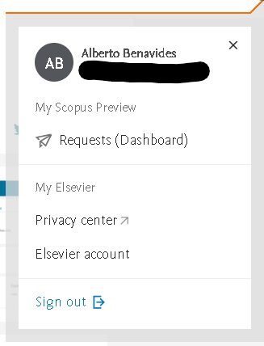

# Tarea 8

Crea una ID ORCID y perfiles de Scopus, Google Scholar y ResearchGate; si ya los tienes, actualízalos. Incluyelos en tu CV junto con tu repositorio de GitHub y actualiza el CV también. Identifica y sigue a por lo menos cinco expertos de tu área en Google Scholar; revisa si tienen cuentas de Twitter y/o GitHub que puedas seguir. Evidencia todas estas actividades en tu entregable de la semana.

# CV
[Curriculum vitae](https://albertobenavides.notion.site/Curriculum-vitae-8488a0c03dd7445caa57dafff6ea800e)

# ORCID
[Perfil](https://orcid.org/0000-0002-4823-8830)

# Scopus

# ResearchGate
[Perfil](https://www.researchgate.net/profile/Alberto-Benavides-3)

# Google Scholar
[Perfil](https://scholar.google.com/citations?user=8e9_suUAAAAJ)

# Perfiles destacados
* [Graciela González Farías](https://scholar.google.com/citations?user=2T-CGvMAAAAJ)
* [Judea Pearl](https://scholar.google.com/citations?user=bAipNH8AAAAJ)
* [Christofer Walters](https://scholar.google.com/citations?user=O8pjnvwAAAAJ)
* [Josh Angrist](https://scholar.google.com/citations?user=LmhqcScAAAAJ)
* [Rob J. Hyndman](https://scholar.google.com/citations?hl=es&user=vamErfkAAAAJ)